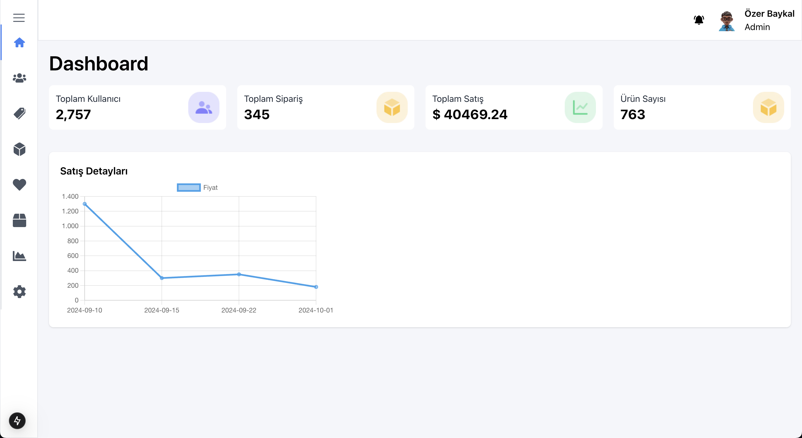
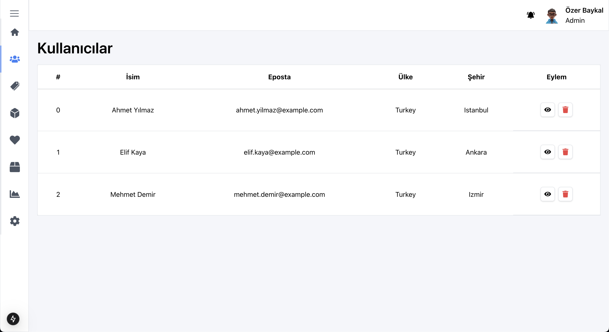
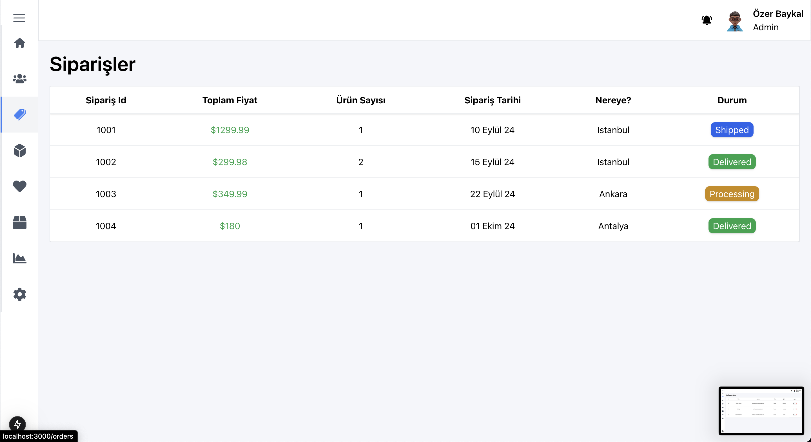
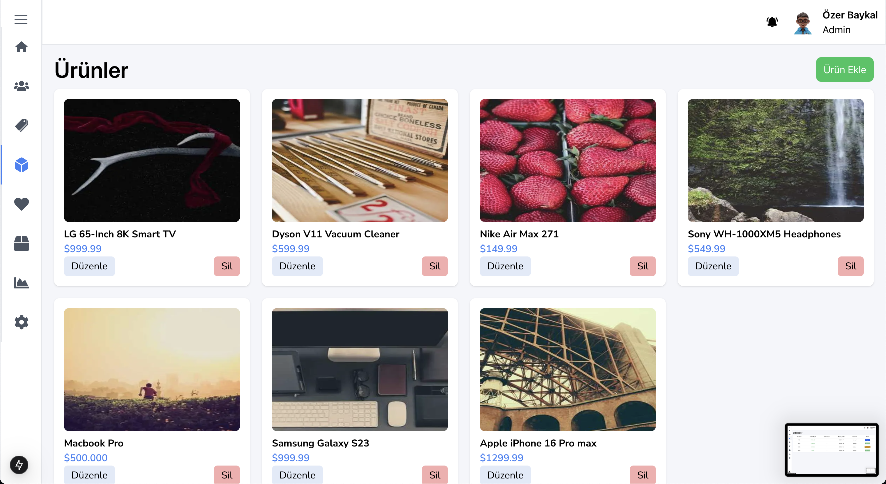

# Next.js Dashboard Application

This is a fully responsive, user-friendly dashboard application built with **Next.js**. The application demonstrates the capabilities of Next.js for developing fast and dynamic web applications. It features real-time API interactions with a `db.json` file and includes multiple pages: **Home**, **Orders**, **Products**, and **Users**.

## Screenshots

## screenrecord gif


### home page



### users page



### order page



## product page



## 🛠️ Features

- **Responsive Design**: Optimized for all screen sizes with a user-friendly interface.
- **Dynamic API**: Fetches data in real-time from a `db.json` file using `json-server`.
- **Interactive Charts**: Visualize data with **Chart.js** and **react-chartjs-2**.
- **Modern Styling**: Styled with **Tailwind CSS** for a clean and consistent look.
- **Toast Notifications**: Provide real-time feedback using **react-toastify**.
- **Icon Library**: Leverage **react-icons** for modern, lightweight icons.

---

## 📋 Pages

### 1. **Home**

- Overview of the dashboard.
- Quick insights and navigation links.

### 2. **Orders**

- Manage and view all orders.
- Fetch order data dynamically from the API.

### 3. **Products**

- View, add, and manage product data.
- Interactive chart to visualize product trends.

### 4. **Users**

- View user data with real-time API integration.
- User management features (add, edit, delete).

---

## 📦 Technologies Used

### Frameworks & Libraries

- **[Next.js](https://nextjs.org/):** The React framework for production-ready web applications.
- **[Tailwind CSS](https://tailwindcss.com/):** Utility-first CSS framework for modern styling.
- **[Chart.js](https://www.chartjs.org/):** A powerful JavaScript library for data visualization.
- **[react-chartjs-2](https://react-chartjs-2.js.org/):** React wrapper for Chart.js.
- **[react-icons](https://react-icons.github.io/react-icons/):** Comprehensive library of popular icons.
- **[react-toastify](https://fkhadra.github.io/react-toastify/):** Simple, customizable notifications for React.
- **[json-server](https://github.com/typicode/json-server):** Full fake REST API for testing and prototyping.

---

## 🚀 Getting Started

### Prerequisites

Ensure you have the following installed:

- **Node.js** (v14 or later)
- **npm** or **yarn**

### Installation

1. Clone the repository:

   ```
   git clone https://github.com/ozerbaykal/dashboard-next-js.git

   cd dashboard-next-js

   ```

2. Install dependencies:

```
 npm install

```

3. Start JSON server:

```
npm run server
```

4. Start the development server:

```
npm run dev
```

Open the application in your browser:

```
http://localhost:3000

```

## Contributing

Contributions are welcome! Please open an issue first to discuss what you would like to change.

- 1.Fork the project
- 2.Create your feature branch (git checkout -b feature/NewFeature)
- 3.Commit your changes (git commit -m 'Add new feature')
- 4.Push to the branch (git push origin feature/NewFeature)
- 5.Open a Pull Request

<h2>Contact</h2>

Özer BAYKAL mail : baykalozer87@gmail.com

Project Link:https://github.com/ozerbaykal/dashboard-next-js
